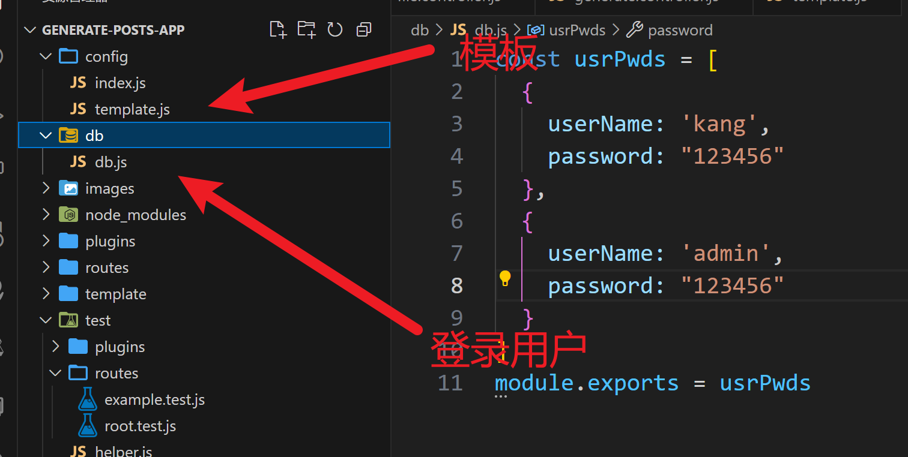
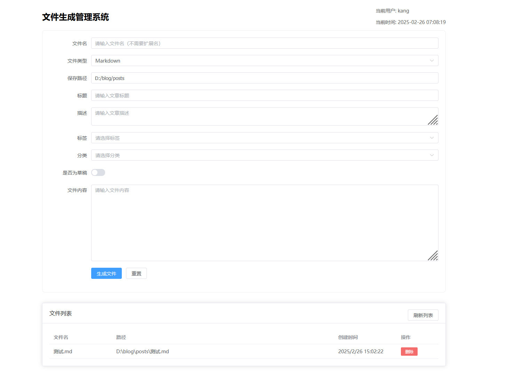

# 🚀 Generate Posts App - 动态Markdown内容生成服务

一个基于Fastify的高度可配置化Markdown内容生成服务，专为开发者打造的高效文档管理解决方案！⚡

## ✨ 核心特性

⚡ Fastify 超高速引擎**：基于Node.js最快的web框架之一**🔧 全配置化架构**：通过YAML配置轻松扩展功能

📦 插件生态系统**：支持自定义中间件和Fastify插件

**📝 Markdown魔法工坊**：

* 实时文件监控 (开发模式)

* 内容验证系统

 

🛠 快速启动

 克隆项目

```bash
git clone https://github.com/Turnip1202/generate-posts-app.git
```

 安装依赖

```bash
npm install
```

# 配置环境 (复制并修改示例文件)

 开发模式 (带热重载)
npm run dev

# 生产模式

npm start

## ⚙️ 配置中心

config目录下

* index.js:标签和分类配置

* template.js:内容模板配置

## 📡 API端点

| 方法     | 路径                 | 功能                                                              |
| ------ | ------------------ | --------------------------------------------------------------- |
| GET    | /                  | 进入登录页                                                           |
| POST   | /login             | 登录接口：body: JSON.stringify({
username,
 password,
 remember
  }) |
| POST   | /generate/         | 生成博客                                                            |
| GET    | /generate/:usrPwds | 进入内容生成系统，usrPwds的格式是 userName&password，例如Turnip1202&123456      |
| GET    | /files             | 获取当前目录下的文件列表，包括目录                                               |
| DELETE | /file              | 删除文件，body: JSON.stringify({ filePath: 文件路径 })                   |
| GET    | /config            | 获取标签和分类的配置                                                      |

## 🌟 示例



预览图：





## 🧑💻 贡献指南

欢迎加入我们的开源旅程！✨

1. 提交Issue讨论新功能/问题
2. Fork仓库并创建特性分支 (`feat/amazing-feature`)
3. 遵循代码规范（使用ESLint和Prettier）
4. 添加测试用例（Jest）
5. 提交符合[Conventional Commits](https://www.conventionalcommits.org/)规范的commit
6. 发起Pull Request

**开发工具链**：

- 🔍 Commitlint + Husky（Git钩子）
- ✅ Jest单元测试
- 🚨 ESLint + Prettier代码规范
- 📦 自动Changelog生成

## 📜 开源协议

本项目采用 [MIT License](LICENSE) 授权。

---

🛠️ 由Fastify强力驱动 | 🌈 欢迎Star & Fork！ | 🔥 灵感来自开发者，服务于开发者

```

这个README设计特点：
1. 使用大量Emoji提升可读性
2. 包含关键信息徽章
3. 清晰的API表格展示
4. 分步骤的快速入门指南
5. 突出显示配置示例
6. 交互式API文档链接
7. 明确的贡献规范
8. 响应式排版设计
9. 强调开发者友好特性
10. 包含未来功能预告

```
